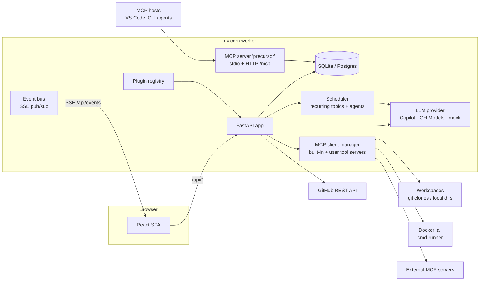

# Architecture

Precursor is a single-process Python service that serves a JSON API and the built
React SPA from the same uvicorn worker. There is **no Node.js runtime in
production**. A small in-process scheduler and an in-process event bus run
alongside the request handlers.

## Process model

A single `uvicorn` worker hosts everything (`precursor/backend/main.py`):

- **FastAPI app** — the JSON API under `/api/*`, the built SPA at `/`, the
  bundled documentation site at `/docs/`, and the MCP server's streamable-HTTP
  endpoint at `/mcp` (gated, loopback-only). FastAPI's own interactive API docs
  move under `/api/*` (`/api/docs`, `/api/redoc`, `/api/openapi.json`) so `/docs`
  is free for the product docs — see [Serving the docs in-app](/reference/api#serving-the-docs-in-app).
- **Scheduler** (`services/scheduler.py`) — an async ticker + bounded worker pool
  that runs due scheduled topics and agents; started/stopped in the app lifespan.
- **Event bus** (`services/events.py`) — in-process pub/sub so multiple browser
  windows stay in sync over a single SSE stream (`/api/events`).
- **MCP session manager** — the `precursor` MCP server's HTTP transport, also
  started in the lifespan.

Version is CalVer, derived from git tags by hatch-vcs at build time and exposed at
`GET /api/version` (and `/api/health`). `GET /api/version/check` reports whether a
newer build exists on the active channel — read-only, since applying an update
replaces the process serving the request.

### Running it as a background app

Everything above is the app itself. `precursor service` wraps that worker in a
supervisor so it can run without a terminal — see
[Background app](/features/background-app) for the user-facing side.

| Module | Role |
| --- | --- |
| `backend/supervisor.py` | spawns and stops the worker; records `pid`/`port`/`url`/`version` in `runtime.json` under the data dir, and derives `status` from it plus a liveness probe |
| `backend/autostart.py` | writes the login items — launchd agent, systemd *user* unit, or Startup entry; one unit for the app, one for the tray |
| `backend/tray.py` | `pystray` menu-bar control behind the `tray` extra; holds no state, every action mirrors a `service` command |
| `services/updates.py` | detects `source` vs `uv-tool` installs and updates each in place |

Two details carry most of the correctness. `working_dir()` decides where the
instance runs — the repo root for a checkout (whose default database URL is
*relative*, so anywhere else would silently mean a different database), the data
dir for an installed wheel. And `instance_settings()` resolves `.env` from
*there* rather than from wherever the CLI happened to be invoked, so the port an
instance comes up on doesn't depend on the caller's working directory.

## Request flow: streamed chat

1. `POST /api/topics/{topic_id}/messages/stream` with the user prompt.
2. The router persists the user `Message`, snapshots history, and builds a system
   prompt that includes the linked GitHub issue body + most-recent comments +
   labels, plus any attached skills / memory.
3. Enabled [MCP tool servers](/features/mcp) are opened for the turn; their tools
   are advertised to the provider. A server that can't be reached (a lapsed
   credential, say) still contributes its **stored** catalogue, so the turn is
   never held up by it and the model is never quietly left without the tool. The
   router runs a **tool loop**: stream text, collect tool calls, execute them,
   append `tool` results, call again — up to a configured max-rounds — until the
   model stops requesting tools. A call that reaches a server needing an
   interactive sign-in raises the prompt **there**, waits, and retries once;
   unattended runs skip the wait and return a tool error instead.
4. Each round is trimmed to a token budget so a few large tool results can't
   overflow the context window.
5. Text deltas and tool-call events stream to the browser over SSE.
6. On stream end (or user "stop"), the assistant turn is persisted using a
   **fresh DB session** (the request-scoped one may be closed by the time the
   generator finishes), and `message.changed` / `stream.ended` events publish.

Scheduled topics run the *same* turn logic off the request path via
`services/turn.py`, driven by the scheduler instead of an HTTP request.

## Database

Models live in `precursor/backend/models/`; async SQLAlchemy 2 via `AsyncSession`.
Highlights:

- **`Topic`** — a self-referencing tree (parent/children). A topic is "scheduled"
  when it has an enabled `TopicSchedule`. Its optional `collection_id` places it
  in a [collection](/features/collections).
- **`Collection`** — a named group of topics (name, slug, description, colour
  accent, optional GitHub repo override, optional default Assistant Role for new
  topics). A protected **General** collection is
  seeded on first boot and every existing topic is backfilled into it.
- **`Message`** — per-topic, cascade delete; roles `user` / `assistant` /
  `system` / `tool`. Large `tool` results can be age-pruned in place.
- **`TopicSchedule`** / **`AgentSchedule`** — recurrence config + run state
  (interval, weekday mask, time-of-day, timezone, lease/status).
- **`AgentSession`** / **`AgentRun`** — the **definition/execution split**.
  `AgentSession` is the reusable definition (objective, model, role, capability
  defaults, `public_id`, and cumulative governance: `token_budget`,
  `max_retries`, `retry_count`, `retry_at`). `AgentRun` is *one execution* — its
  own `status`, `copilot_session_id`, transcript counters, token meter and a
  frozen capability snapshot, tagged with the `trigger` that opened it and,
  when a pipeline drove it, its `workflow_run_id` / `workflow_run_step_id`.
  This mirrors `Workflow` → `WorkflowRun` → `WorkflowRunStep`, and is what makes
  a single agent safe to share between two concurrent workflows: every runtime
  registry, the live SDK session, artifacts, events and token accounting are
  keyed by **run**, not by agent. `AgentSession.current_run_id` points at the
  live one, and the agent's execution columns are a write-through **mirror** of
  that run so list/inbox/dashboard reads stay a single cheap lookup.
- **`AgentTrigger`** / **`AgentArtifact`** / **`AgentBlueprint`** — the
  [agent orchestrator](/features/agents-mode/orchestration): webhook/manual
  triggers, the shared-artifact blackboard (scoped to the `AgentRun` that
  published each artifact), and reusable task+governance templates.
- **`AgentState`** / **`WorkflowState`** — the two durable key/value stores that
  survive a re-run, unlike artifacts: an
  [agent's private scratchpad](/features/agents-mode/artifacts-state#durable-state-the-private-scratchpad)
  and a
  [pipeline's shared memory](/features/workflows/steps#pipeline-state-what-a-workflow-remembers).
  Only the **key index** enters a prompt; bodies are fetched on demand through
  MCP tools.
- **`Workspace`** — a git clone or plain folder.
- **`Skill`** — an enablement record for a file-backed `SKILL.md` prompt preset.
- **`Memory`** — long-term notes injected into the system prompt.
- **`Attachment`** — file metadata + a `sha256` pointer; **bytes live on disk** as
  content-addressed blobs, deduped, with a startup GC sweep.
- **`MCPServer`** — user-defined external MCP tool servers.
- **`MCPToolCache`** — each MCP server's last-known tool catalogue, so it survives
  a restart and is available before anything connects.
- **`IssueContextCache`** — cached GitHub issue summary/state/labels (TTL refresh).
- **`AppSetting`** — JSON key/value for runtime settings and **secrets that are
  never echoed back** (only `*_present` booleans are returned).

The schema is managed entirely by **Alembic**: `init_db` runs `alembic upgrade
head` on startup, building a fresh database from migrations or migrating an
existing one — dev and prod alike, no `create_all`.

## GitHub integration

`services/github_client.py` wraps just the endpoints the app needs (list/get
issues, list comments, list labels, create/update issue, post comment). Topic
context is rebuilt on every turn so changes to the linked issue propagate
instantly; the result is cached (`IssueContextCache`) with a TTL. Auth resolves
in order: a token saved in settings, then the GitHub CLI session
(`gh auth token`). With neither, the LLM falls back to the mock provider.

The **repository** an issue is created in resolves through
`services/collections.resolve_topic_github_repo()`, which walks three levels and
returns the first non-empty value: the topic's own `github_repo`, then its
collection's, then the global `github_repo` setting.

## LLM provider abstraction

`services/llm/base.py` defines a small protocol — two streaming methods (plain
text and a tool-capable event stream) plus `list_models()`. Providers are declared
in `services/llm/registry.py`; `get_llm_provider(session)` reads the active
provider + config from the DB per request and constructs it, falling back to the
mock when credentials are missing. Shipped providers: **GitHub Copilot**
(default), **Azure AI Foundry**, **OpenAI-compatible**, and **Mock**. Adding a
provider is one `ProviderSpec` plus an implementation class.

**Two endpoints, one provider.** Copilot splits its catalogue across
`/chat/completions` and the newer Responses API, and a model served by one is
rejected by the other. `github_copilot.py` reads the `supported_endpoints` each
model publishes, drops any model neither endpoint can serve, and routes the rest
to the right surface; `_responses_compat.py` translates that surface back into
the same four provider events (`text_delta`, `tool_calls`, `usage`,
`turn_done`), so the turn engine never learns which API answered. A model we
haven't catalogued yet is tried on `/chat/completions` first and transparently
retried on Responses if it is refused, which keeps the hot path free of an
extra round-trip and self-corrects for the rest of the process's life.

**Refusals that don't mean no.** Copilot serves a given model from only part of
its fleet, so the same request alternates between `200` and
`400 model_not_available_for_integrator` — a 4xx that says nothing durable about
the model. `open_stream_with_retry` in `_openai_compat.py` retries just that code
a handful of times while opening the stream. Retrying is safe there because the
refusal lands *before* the first token is yielded, so a second attempt cannot
duplicate output; every other 4xx is translated and raised on the first try,
since retrying a verdict that won't change only delays the message.

## MCP

Precursor is both an MCP client and an MCP server.

- **As client** (`services/mcp/client.py`) — an `MCPClientManager` holds the
  tool-server registry: built-ins (`github`, `workiq`, `playwright`, `fetch`,
  `workspace-fs`, `drawio`, `cmd-runner`, `precursor`) plus user-defined servers.
  Servers are toggled in Settings; sessions are kept warm in a per-server pool
  across turns. `services/mcp/warmup.py` connects the enabled ones sequentially
  in the background after startup, and `services/mcp/tool_cache.py` persists each
  catalogue so it survives a restart.
- **As server** (`services/mcp/precursor_server.py`) — a `FastMCP` server exposing
  Precursor's own data, gated per-section by `mcp_expose` (off by default), over
  **stdio** and an in-process **HTTP** transport at `/mcp` (off by default,
  loopback-only, Host-header allowlisted).

See the [MCP feature guide](/features/mcp) for the user-facing side.

## Scheduler

`services/scheduler.py` drives recurring topics **and** scheduled agents: a single
async ticker enqueues due `TopicSchedule` and `AgentSchedule` rows, a bounded
worker pool runs each, with DB row leasing for crash recovery. Scheduled prompts
that start with a slash command are dispatched to that command's backend action;
`/guard` directives gate a run behind a cheap MCP probe. The same ticker also
drives the [agent orchestrator](/features/agents-mode/orchestration):
re-running failed agents whose exponential-backoff retry is due, sweeping
orphaned `pending` agents (via `services/agents/fleet.py`), and honouring the
concurrency governor. See the
[scheduler feature guide](/features/scheduler).

## Workspaces

A `Workspace` is a git clone or local directory the assistant can browse and edit.
`services/workspace_git.py` clones/pulls/commits (token injected at op time, never
stored); `services/workspace_fs.py` does sandboxed file ops — every path is routed
through `safe_join`, which rejects traversal outside the workspace root and blocks
`.git`. The same sandbox backs the `workspace-fs` and `drawio` MCP servers.

## SPA

Vite + React 19 + Tailwind, built to `frontend/dist` and bundled inside the wheel.
All HTTP goes through `src/lib/api.ts`; streaming chat uses a manual SSE reader
(`src/lib/sse.ts`) since it POSTs a JSON body; cross-window sync uses the
`/api/events` SSE stream. Theming is via CSS variables (`light` / `dark` /
`system`).

## Security & deployment model

::: warning Single-user, no auth
Precursor is designed as a **single-user, local-first** app and ships with **no
authentication**. Run it bound to `127.0.0.1` (the default) and don't expose it to
a network without your own authenticating reverse proxy.
:::

Specifically:

- The API and SPA have **no auth** — anyone who can reach the port has full access
  to your topics, settings, and stored tokens.
- The optional [command-runner](/features/command-runner) can execute
  shell/python/node — keep the Docker jail enabled.
- The [MCP-over-HTTP](/features/mcp) transport is off by default and only binds to
  loopback.
- Secrets (GitHub token, provider keys) live in the local DB and are **never
  echoed** by the API — only `*_present` booleans are returned.

See [SECURITY.md](https://github.com/lrivallain/precursor/blob/main/SECURITY.md)
for vulnerability reporting.
